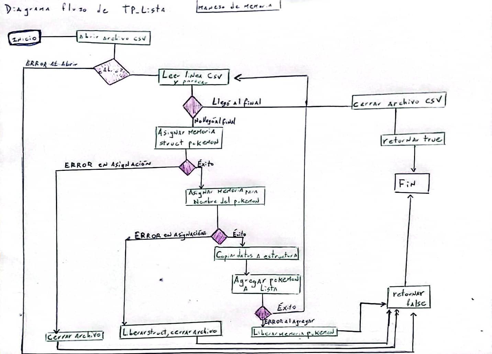
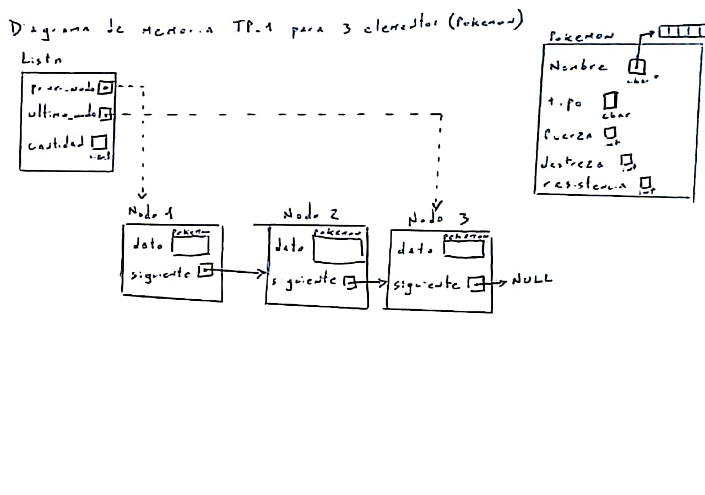
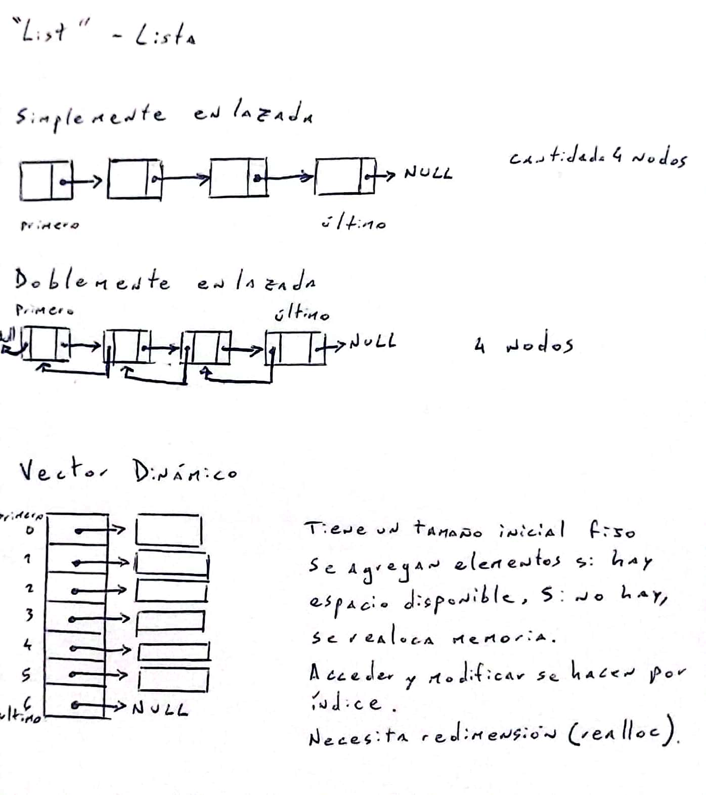
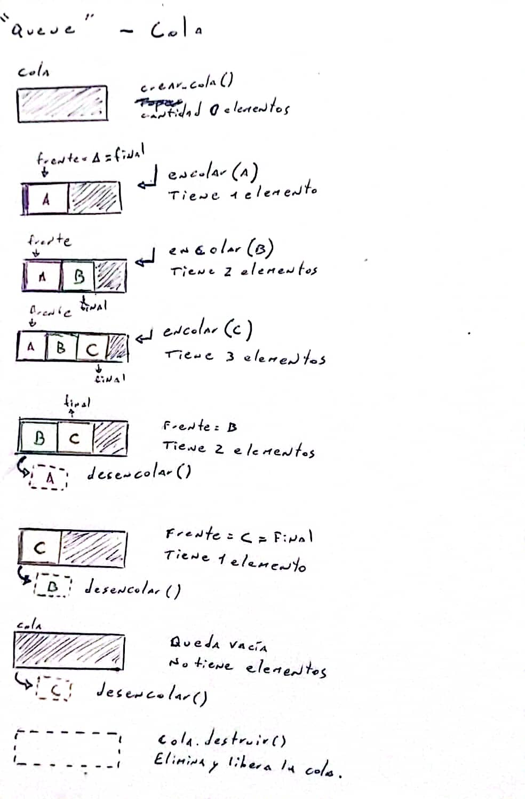
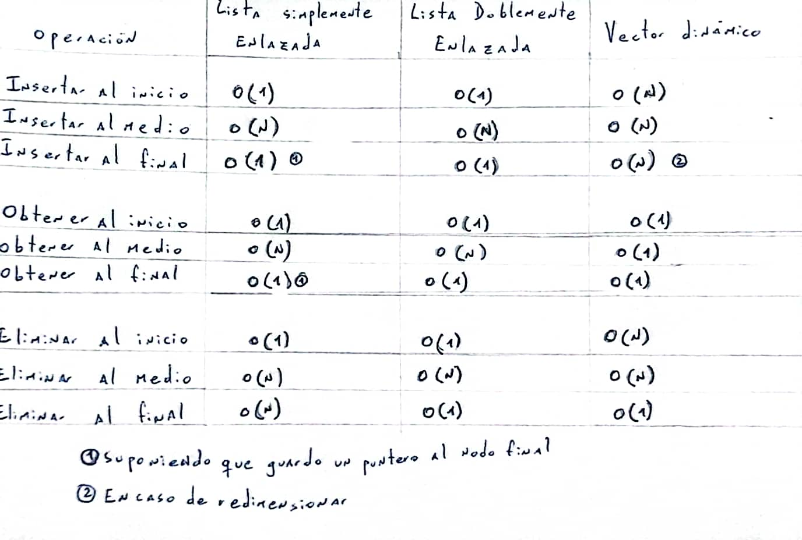

<div align="right">

</div>

# TDA LISTA

## Alumno: Laura Maciel - 111415 - lamaciel@fi.uba.ar

- Para compilar:

```bash
make tpLista
```

- Para ejecutar:

```bash
make tpLista
```

- Para ejecutar con valgrind:
```bash
make valgrind-tpLista
```

---

##  Funcionamiento del TP Lista

El programa TP Lista funciona como una Pokedex: almacena y brinda informacion de pokemones utilizando una lista enlazada. Funciona de la siguiente manera:

1. Abre el archivo CSV proporcionado como argumento y lo lee línea por línea, creando un registro por cada línea parseada e incorporándolo a la Pokedex (lista enlazada).
2. El usuario puede elegir entre dos opciones: buscar un Pokémon por nombre o mostrar todos los Pokémon. 

    -> Al seleccionar la opcion '1', se solicita un nombre y se realiza la búsqueda del mismo en la lista. Si se encuentra el pokemon, se imprime. Caso contrario, se informa al usuario que el pokemon buscado no fue encontrado.

    -> Si se opta por la opcion '2', se imprime cada Pokémon de la lista.

    -> Si se ingresa otro caracter, se imprime un mensaje de 'opcion inválida'.

3. Finalmente, se libera la memoria utilizada por la lista y sus elementos.

### MANEJO DE MEMORIA

En el siguiente gráfico se muestra el flujo de memoria durante el programa
<div align="center">

</div>

### ESTRUCTURAS UTILIZADAS

**Struct Pokemon**
```c
struct pokemon {
    char *nombre;
    char tipo;
    int fuerza;
    int destreza;
    int resistencia;
};
```
Esta estructura representa a un Pokémon individual. Posee un puntero a char para el nombre para permitir nombres de longitud variable, optimizando el uso de memoria.

**Struct Lista y Nodos**
```c
struct nodo {
    void *dato;
    struct nodo *prox_nodo;
};

struct lista {
    size_t largo_lista;
    struct nodo *primer_nodo;
    struct nodo *ultimo_nodo;
};
```
La estructura utilizada fue una lista simplemente enlazada (LSE). Para poder insertar y obtener elementos al final en tiempo constante O(1) se mantiene un puntero al ultimo nodo de la lista. El uso de void *dato permite al usuario almacenar cualquiercosa en la lista como dato. En esta implementación, se almacenan pokemones. La siguiente imagen muestra la estructura implementada con tres pokemones agregados:

<div align="center">

</div>

Otras dos estructuras utilizadas en el TP son **archivo_csv** e **iterador_lista**.
En resumen, la interacción de las estructuras a lo largo del trabajo es la siguiente:

    -> La lista simplemente enlazada actúa como contenedor principal.

    -> Cada nodo de la lista contiene un puntero a una estructura pokemon.

    -> El iterador de la lista se utiliza para recorrer los nodos y acceder a las estructuras pokemon.

    -> La estructura de archivo CSV se utiliza temporalmente durante la carga de datos para llenar la lista con las estructuras pokemon.


### ACLARACION EXTRA SOBRE IMPLEMENTACIÓN
En la implementación de **lista_agregar_elemento**, se acordó en clase que si se pasa una posición mayor que la longitud actual de la lista, no se guardará el elemento. Esto se refleja en el código de la siguiente manera:

```c
bool lista_agregar_elemento(Lista *lista, size_t posicion, void *cosa)
{
    if (!lista || posicion > lista_cantidad_elementos(lista)) {
        return false;
    }
    //resto de la función
}
```

---

## Respuestas a las preguntas teóricas

### TDA Lista
<div align="center">

</div>
Una lista es una estructura de datos que organiza elementos en una secuencia ordenada, permitiendo el acceso a cualquier posición dentro de ella.
Su conjunto mínimo de operaciones incluye:

    -> Insertar: Añadir un elemento en una posición específica.

    -> Eliminar: Eliminar un elemento de una posición específica.

    -> Acceder: Obtener un elemento por su posición.

    -> Recorrer: Navegar secuencialmente por todos los elementos

Tiene algunas variantes de implementación, entre ellas:

    -> Lista enlazada: Los elementos se almacenan en nodos independientes, donde cada nodo contiene un valor. Dependiendo del número de referencias que mantiene cada nodo, se      clasifican en:

        -> Lista simplemente enlazada (LSE): Cada nodo tiene una única referencia al siguiente nodo en la secuencia.

        -> Lista doblemente enlazada (LDE): Cada nodo tiene dos referencias. Una al nodo siguiente y otra al nodo anterior, permitiendo recorrer la lista en ambas direcciones.

    -> Lista basada en Vector Dinámico: Los elementos se almacenan en un bloque continuo de memoria.

### TDA Pila
<div align="center">

</div>

Una pila ('stack') es una colección ordenada de elementos en la que las operaciones de inserción y eliminación solo se realizan en un extremo ('tope'). Sigue el principio LIFO (Last In, First Out): el último elemento que se apila es el primero en desapilarse. Su conjunto mínimo de operaciones incluye:

    -> Apilar ('Push'): Inserta un elemento en el tope de la pila.

    -> Desapilar ('Pop'): Elimina y devuelve el elemento en el tope.

    -> Ver tope: Devuelve el elemento en el tope sin eliminarlo.

### TDA Cola
<div align="center">

</div>

Una cola ('queue') es una estructura ordenada de datos donde las operaciones de inserción y eliminación se realizan en extremos opuestos. El inicio (frente) es donde se eliminan los elementos, y el final ('rear') es donde se insertan. Sigue el principio FIFO (First In, First Out): el primer elemento en entrar es el primero en salir. Su conjunto mínimo de operaciones incluye:

    -> Encolar ('Enqueue'): Inserta un elemento en el final de la cola.

    -> Desencolar ('Dequeue'): Elimina y devuelve el elemento del frente de la cola.

    -> Ver frente ('Front'): Devuelve el elemento en el frente sin eliminarlo.

### Explicacion de complejidades entre implementaciones de lista:

En la siguiente tabla se muestra una comparación de las complejidades para las operaciones de inserción, obtención y eliminación en diferentes implementaciones de listas:
<div align="center">

</div>

1. **Operaciones al Inicio**

    -> Insertar

    En ambas listas enlazadas (LSE y LDE), la operación se puede realizar en tiempo constante O(1) ya que solo se necesita actualizar el puntero que señala al primer elemento. En la LDE, además, se actualiza el puntero anterior al antiguo primer elemento en tiempo constante. En un vector dinámico, esta operación requiere un tiempo O(n) debido al desplazamiento de todos los elementos una posición hacia la derecha para hacer espacio para el nuevo elemento.

    -> Obtener

    Para acceder al primer elemento, todas las estructuras poseen una complejidad de O(1). Esto es porque el primer elemento es accesible en todas ellas.

    -> Eliminar

    En las listas enlazadas es O(1), ya que solo se necesita actualizar el puntero que apunta al primer elemento. En ambas, se actualiza el puntero anterior al nuevo primero en tiempo constante. En un vector dinámico, eliminar el primer elemento requiere desplazar todos los elementos hacia atrás, resultando en una complejidad de O(n).

2. **Operaciones en el Medio**

    -> Insertar

    Para insertar un elemento en el medio de las listas enlazadas se debe recorrer hasta la posición deseada, resultando en una complejidad de O(n). En el caso de la lista doblemente enlazada, puede ser un poco más eficiente si se inserta cerca del final, pero generalizado sigue siendo O(n). Para un vector dinámico, la complejidad es también O(n) debido a desplazar elementos y posiblemente redimensionar el vector.

    -> Obtener

    Obtener un elemento en una posición intermedia implica recorrer la lista, por lo tanto es O(n) para las listas enlazadas. 
    En el vector dinámico, el acceso a cualquier índice es O(1).

    -> Eliminar

    Eliminar un elemento en el medio de las listas enlazadas requiere recorrer hasta la posición de eliminación, resultando en O(n) en ambas. 
    En el vector dinámico, la complejidad también es O(n) debido al desplazamiento de elementos que se necesita después de la eliminación.


3. **Operaciones al Final**

    -> Insertar 

    La inserción al final de una LSE puede ser O(n) si se necesita recorrer toda la lista para llegar al último elemento, pero en caso de mantener un puntero al último elemento, se puede realizar en O(1). Por otro lado, en la LDE, se puede insertar directamente al final en O(1), ya que se tiene acceso al último elemento. En un vector dinámico, la inserción puede llegar a ser O(n) en situaciones donde el vector necesita redimensionarse.

    -> Obtener 

    Obtener el último elemento en una LSE puede ser O(n) o O(1), dependiendo de si se mantiene un puntero al final. 
    La lista doblemente enlazada, al igual que el vector dinámico, permite el acceso directo al último elemento en O(1).

    -> Eliminar

    En la LSE, la complejidad temporal es O(n). Al no mantener en nodo anterior es necesario recorrer la lista buscando el elemento que apunta al que quiero eliminar para poder actualizar el puntero al siguiente del eliminado. En LDE no tengo ese problema, por lo que la operación es O(1).
    En un vector dinámico, la operación también es O(1): solamente se actualiza el tamaño del vector.

### Explicación de la complejidad de mi implementación en pila.c y cola.c

**OPERACIONES DE PILA (pila.c)**

    -> pila_crear(): O(1), crea una lista vacía y la castea a pila.

    -> pila_destruir(Pila *pila): O(n), recorre todos los elementos de la pila para liberarlos.

    -> pila_destruir_todo(Pila *pila, void (*f)(void *)): O(n), recorre la pila mientras aplica una función a cada elemento.

    -> pila_cantidad(Pila *pila): O(1), retorna el valor almacenado en la pila.

    -> pila_tope(Pila *pila): O(1), accede al inicio de la pila (*primer_nodo).

    -> pila_apilar(Pila *pila, void *cosa): O(1), agrega un elemento al inicio de la pila.

    -> pila_desapilar(Pila *pila): O(1), elimina el primer elemento de la pila (utilizando la direccion del *primer_nodo de la lista).

    -> pila_esta_vacía(Pila *pila): O(1) verifica si la cantidad de elementos es cero. 


**OPERACIONES DE COLA (cola.c)**

    -> cola_crear(): O(1), crea una lista vacía y la castea a cola.

    -> cola_destruir(Cola *cola): O(n), recorre todos los elementos de la cola para liberarlos.

    -> cola_destruir_todo(Cola *cola, void (*f)(void *)): O(n), recorre la cola y va aplicando una función a cada elemento.

    -> cola_cantidad(Cola *cola): O(1), retorna el valor almacenado en la cola.

    -> cola_frente(Cola *cola): O(1) accede al primer elemento de cola, como guardamos la direccion en un puntero (*primer_nodo), es constante.

    -> cola_encolar(Cola *cola, void *cosa): O(1), agrega un elemento al final de la lista. Teniendo un puntero al ultimo elemento de la cola, es constante.

    -> cola_desencolar(Cola *cola): O(1) elimina el primer elemento de la cola.

    -> cola_esta_vacía(Cola *cola): O(1) verifica si la cantidad de elementos es cero.

